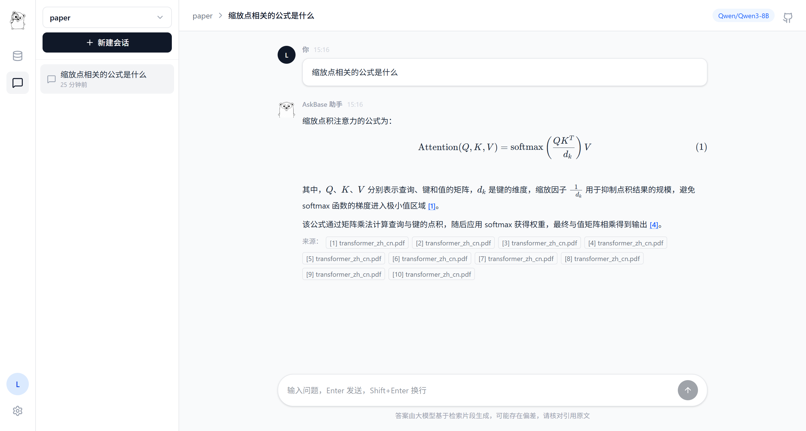
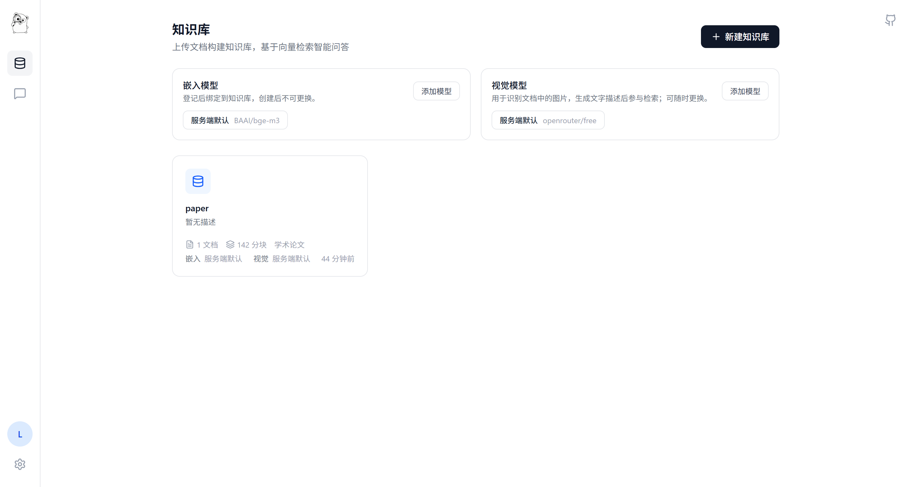
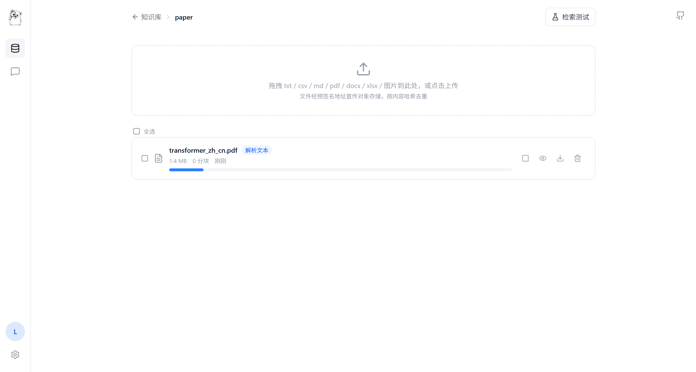
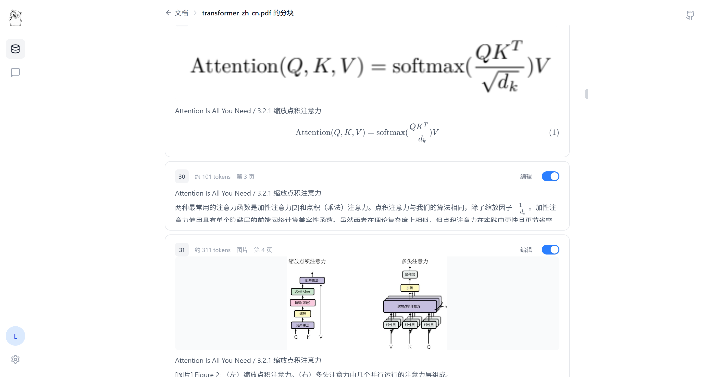
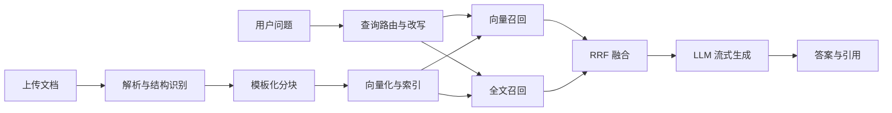
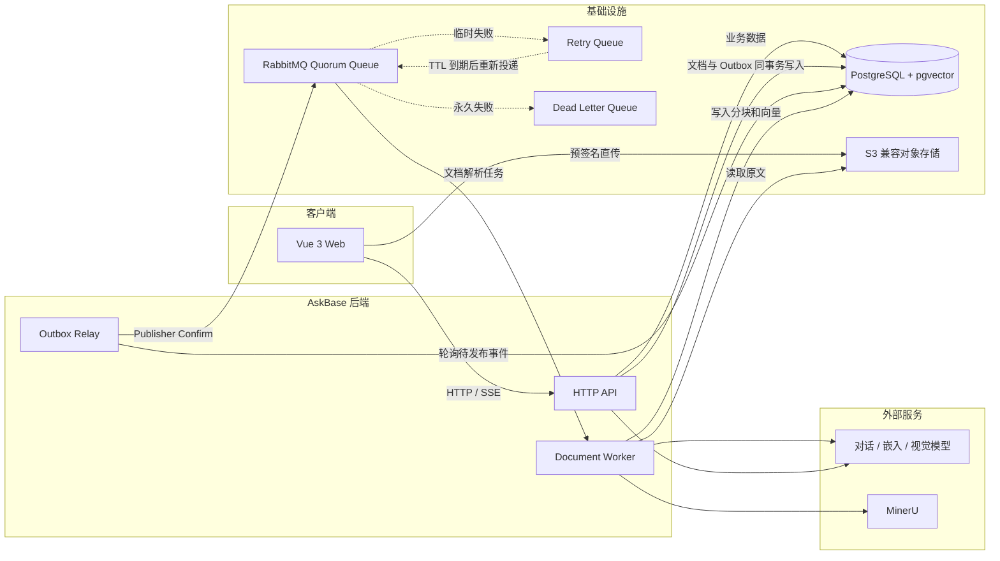

<p align="center">
  
</p>

<p align="center">
  开源的个人知识库问答系统
</p>

<p align="center">
  <a href="https://go.dev/"></a>
  <a href="https://vuejs.org/"></a>
  <a href="https://www.postgresql.org/"></a>
  <a href="https://www.rabbitmq.com/"></a>
</p>

AskBase 将散落的 PDF、Office 文档、Markdown 和图片整理成可检索、可追溯的个人知识库。上传文档后，系统自动完成解析、分块、向量化与索引；提问时通过向量检索和全文检索联合召回，并以流式回答和 `[n]` 引用展示答案依据。

AskBase 使用 Go、PostgreSQL + pgvector 和 RabbitMQ 构建完整的文档处理与检索增强生成链路，专注个人文档管理、检索与问答。

> 当前项目仍在持续开发中，接口、配置和数据结构可能发生变化，不建议直接用于生产环境。

## 为什么是 AskBase

- **多格式文档理解**：支持 TXT、CSV、Markdown、PDF、DOCX、XLSX 和图片；复杂 PDF 可按需接入 MinerU 与视觉模型。
- **面向内容的解析模板**：内置通用文档、书籍、论文、简历和问答对模板，按文档结构选择解析与分块策略。
- **混合检索**：使用 pgvector HNSW 向量索引和 PostgreSQL `tsvector` 全文索引，通过 RRF 融合两路结果。
- **可验证回答**：SSE 流式生成答案，正文内联 `[n]` 引用，可回看命中的文档与原始分块。
- **可靠异步处理**：Transactional Outbox、RabbitMQ Quorum Queue、延迟重试和 DLQ 共同保证文档任务至少投递一次。
- **可观察的处理过程**：展示文档解析状态与进度，支持失败重试、停止任务以及文档或分块级检索开关。
- **检索评测工具**：内置检索测试台和离线黄金集评测器，可检查查询路由、召回结果与稳定性。

## 产品界面

AskBase 已包含以下主要界面：

| 界面 | 能力 |
| --- | --- |
| 知识库 | 创建知识库、选择解析模板、查看文档与分块统计 |
| 文档管理 | 批量上传、解析进度、启停、预览、下载、失败重试 |
| 分块管理 | 查看和编辑解析结果、控制单个分块是否参与检索 |
| 检索测试 | 调整 TopK 与相似度阈值，直接检查混合召回结果 |
| 知识问答 | 多轮对话、查询改写、流式回答、引用原文溯源 |

### 知识问答

基于知识库发起多轮对话，在回答中通过编号引用定位原始文档依据。



### 知识库管理

为知识库配置嵌入模型、视觉模型和解析模板，并集中查看文档与分块统计。



### 文档处理

批量上传文档，实时查看解析阶段、处理进度，并对文档执行预览、下载和删除操作。



### 分块管理

查看文本、公式与图片等解析结果，编辑分块内容，并控制单个分块是否参与检索。



## 工作流程



## 系统架构



后端使用同一个镜像提供三个独立进程：

- `askbase-server`：只提供 HTTP API，不直接连接 RabbitMQ。
- `askbase-worker`：消费文档解析任务，默认并发数和 prefetch 均为 1。
- `askbase-relay`：将 PostgreSQL Outbox 中的待发布事件可靠投递到 RabbitMQ。

同一镜像还包含一次性任务 `askbase-migrate`，负责在这些长期运行进程启动前应用数据库迁移。

这一进程边界可直接对应 K8s 中的三个 Deployment；仓库当前暂未提供 K8s manifests。

## 快速开始

### 环境要求

- Docker 与 Docker Compose
- 可用的 OpenAI 兼容对话与嵌入模型 API
- S3 兼容对象存储，例如 Cloudflare R2、AWS S3 或 MinIO

### 1. 创建本地配置

Linux / macOS：

```bash
cp be/config.example.yaml be/config.yaml
```

Windows PowerShell：

```powershell
Copy-Item be/config.example.yaml be/config.yaml
```

[`be/config.example.yaml`](./be/config.example.yaml) 是可提交的脱敏模板，`be/config.yaml` 是本地实际配置并已被 Git 忽略。

### 2. 填写必要配置

修改本地的 `be/config.yaml`：

| 配置段 | 是否必填 | 用途 |
| --- | --- | --- |
| `embedding` | 是 | OpenAI 兼容嵌入服务；`dimension` 必须匹配模型输出 |
| `llm` | 是 | OpenAI 兼容对话模型 |
| `storage.s3` | 是 | 文档和解析图片的对象存储 |
| `auth.secret` | 是 | 登录会话签名密钥，部署前必须替换 |
| `auth.devCode` | 仅开发 | 开发环境万能验证码，示例值为 `123456`，可以修改或置空 |
| `mail` | 生产必填 | `echo`、`smtp` 或 `resend`；本地可使用 `echo` |
| `vision` | 可选 | 图片和扫描页的视觉解析模型 |
| `mineru` | 可选 | 复杂 PDF、表格、公式和版面解析 |

配置加载优先级为：**环境变量 > `config.yaml` > 程序默认值**。本地直接使用 YAML；Docker 或 K8s 部署时可将 `config.yaml` 作为只读配置挂载，并通过 Secret 对应的环境变量覆盖密码和 API Key。

不要把真实 API Key、对象存储密钥或生产密码写入 `config.example.yaml`。`env: "prod"` 时 `auth.devCode` 即使有值也不会生效，并且 `auth.secret` 为空会拒绝启动。

### 3. 启动完整服务

```bash
docker compose up --build -d
```

Compose 会启动以下服务：

- `frontend`：Nginx 托管前端资源，并将 `/api` 反向代理到 API
- `backend-migrate`：按版本执行待应用的数据库迁移，成功后退出
- `backend-api`：HTTP API
- `backend-worker`：文档解析消费者
- `backend-relay`：Outbox 事件发布器
- `postgres`：PostgreSQL + pgvector
- `rabbitmq`：RabbitMQ Management

启动完成后访问：

- AskBase：<http://localhost:8080>
- RabbitMQ 管理界面：<http://localhost:15672>

示例配置处于开发环境，可使用任意邮箱和验证码 `123456` 登录；该验证码由 `auth.devCode` 配置，可以修改或置空。

Compose 中 PostgreSQL 与 RabbitMQ 的开发密码可以通过当前 shell 的 `POSTGRES_PASSWORD`、`RABBITMQ_USERNAME` 和 `RABBITMQ_PASSWORD` 覆盖，不要求创建 `.env` 文件。公网部署时应通过部署平台 Secret 注入，并设置 `APP_ENV=prod` 与高强度 `AUTH_SECRET`。

查看日志或停止服务：

```bash
docker compose logs -f
docker compose down
```

## 本地开发

本地开发前端需要 Node.js `^20.19.0` 或 `>=22.12.0`。

### 1. 启动基础设施

```bash
docker compose up -d postgres rabbitmq
```

### 2. 启动后端

先执行数据库迁移：

```bash
cd be
go run ./cmd/migrate
```

然后分别在三个终端运行：

```bash
cd be
go run ./cmd/server
```

```bash
cd be
go run ./cmd/worker
```

```bash
cd be
go run ./cmd/relay
```

### 3. 启动前端开发服务器

```bash
cd fe
pnpm install --frozen-lockfile
pnpm dev
```

开发服务器位于 <http://localhost:5173>，并通过 Vite 代理访问本地 `8082` 端口的 API。

Windows 本地运行涉及 PDF 页面渲染时，请先阅读 [`be/scripts/README.md`](./be/scripts/README.md) 安装 PDFium。`be/scripts` 不会被 `go run` 自动执行。

## 核心设计

### 1. 浏览器直传与内容幂等

浏览器先计算 SHA-256，再向 API 申请预签名 PUT URL 并直传对象存储，文件内容不经过 API 进程。`(dataset_id, file_hash)` 唯一约束防止同一知识库重复登记相同文件。

### 2. 文档解析与可靠队列

文档记录和 Outbox 事件在同一个 PostgreSQL 事务中提交。Relay 使用 `FOR UPDATE SKIP LOCKED` 并发获取事件，消息收到 RabbitMQ publisher confirm 后才标记为已发布。Worker 使用 manual ACK；临时失败进入延迟重试队列，永久失败或重试耗尽后写入文档失败状态并进入 DLQ。

`parse_version` 用于淘汰手动重试前的旧消息，PostgreSQL advisory lock 用于避免多个 Worker 同时处理同一文档。锁当前会占用一个数据库连接，代码中已保留后续迁移至 Redis 分布式锁的 TODO。

### 3. 模板化文档处理

- 通用文档和简历优先读取本地文字层，必要时升级到 MinerU。
- 书籍检测到内嵌图片时升级到 MinerU，尽量保留图文结构。
- 论文固定使用 MinerU 处理版面、表格与公式。
- 问答对模板按照文件结构识别问题与答案，每组问答独立成块，并以问题作为主要向量化文本。

MinerU 在线模式会把原始 PDF 上传到第三方服务，敏感文档启用前请确认数据合规要求。

### 4. 混合检索与查询规划

向量路使用 pgvector 余弦相似度与 HNSW 索引；全文路使用 `tsvector` GIN 索引，中文通过内置单字和相邻双字词元参与匹配。两路结果按 RRF 融合：

```text
RRF(d) = Σ 1 / (60 + rank_i(d))
```

对话进入检索前会判断是否无需检索、直接检索、结合历史改写，或拆分为多个子查询。全文检索异常时会降级为仅向量检索，不阻断回答链路。

### 5. 引用与上下文

检索分块以编号上下文注入提示词，模型在答案中使用 `[n]` 标注依据；引用的分块 ID 持久化到消息记录，刷新页面后仍可查看原文。当前上下文使用固定数量的历史消息，后续将改为基于 token 水位线的滑动窗口，并压缩窗口外历史。

## 离线检索评测

评测器复用在线对话的查询规划与检索链路，可基于私有 JSONL 黄金集检查路由分类、证据召回和多次运行稳定性。

```bash
cd be
go run ./cmd/rageval --cases ./eval/cases.jsonl --output ./eval/results
```

数据格式与指标说明见 [`be/eval/README.md`](./be/eval/README.md)。评测结果可能包含私人文档片段，请勿直接提交或分享。

## 项目结构

```text
AskBase/
├── docker-compose.yml       # 完整本地容器编排
├── be/
│   ├── cmd/
│   │   ├── migrate/         # 数据库迁移任务
│   │   ├── server/          # HTTP API
│   │   ├── worker/          # 文档解析消费者
│   │   ├── relay/           # Outbox relay
│   │   └── rageval/         # 离线检索评测
│   ├── config.example.yaml  # 可提交的脱敏配置模板
│   ├── migrations/          # 编译进迁移任务的版本化 SQL
│   ├── internal/
│   │   ├── migration/       # 迁移发现、排序与事务执行
│   │   ├── handler/         # HTTP 适配层
│   │   ├── service/         # 业务逻辑与 RAG 编排
│   │   ├── repo/            # 数据访问
│   │   ├── queue/           # RabbitMQ 拓扑与消息收发
│   │   ├── outbox/          # Outbox 发布
│   │   ├── worker/          # 文档流水线编排
│   │   │   ├── parser/      # 文档解析与 PDF 渲染
│   │   │   └── chunker/     # 分块、token 估算与稳定 ID
│   │   ├── llm/             # OpenAI 兼容模型客户端
│   │   └── storage/         # S3 兼容对象存储
│   └── Dockerfile           # 构建四个后端二进制到同一镜像
└── fe/                      # Vue 3 + Vite + Tailwind CSS
    ├── Dockerfile           # 构建前端并由 Nginx 提供服务
    └── nginx.conf           # 静态资源、SPA 回退与 API/SSE 代理
```

## 当前边界

- 尚未接入 Rerank 模型，当前排序结果来自向量/全文召回与 RRF 融合。
- 尚未提供 K8s manifests、DLQ 管理页面和人工重放 API。
- 邮箱验证码缓存在 API 进程内；多 API Pod 部署前需要改为共享存储。
- 数据库迁移只支持向前执行 `.up.sql`，暂不提供自动回滚。

## 开发与验证

```bash
cd be
go test ./...
```

```bash
cd fe
pnpm build
```

欢迎通过 [Issues](https://github.com/lindaren-user/askbase/issues) 提交问题和建议。
